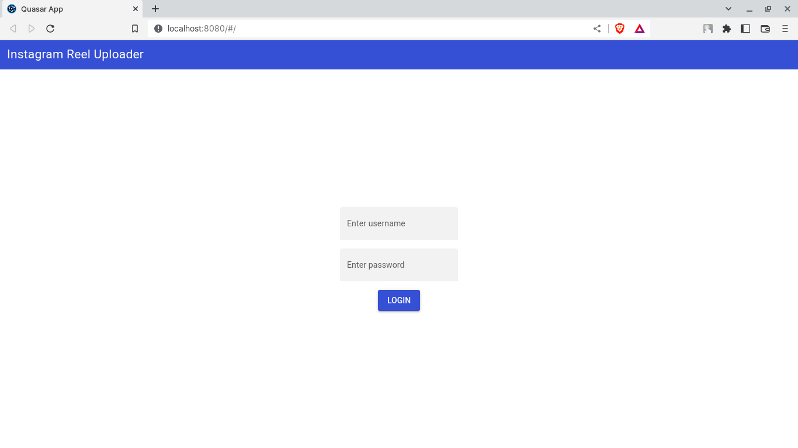

# Instagram Reel Uploader App

### Simple Application for uploading reels on your instagram account. Created using flask, quasar.

<div>
    
</div>

<br/>

### Instructions for starting the app
> Step 1 - Open a terminal in api folder

> Step 2 - Install the required packages ( For windows ) 

```sh
python install -r requirements.txt
```

> Step 2 - Install the required packages ( For linux/mac ) 

```sh
python3 install -r requirements.txt
```

> Step 3 - Start the server ( windows )

```sh
python3 main.py
```

> Step 3 - Start the server ( linux/mac )

```sh
python3 main.py
```

<br/>

> Step 4 - Open a terminal in client folder

> Step 5 - Install all the dependencies

```sh
npm install
```

> Step 6 - Install quasar cli ( if not exists )

```sh
npm install -g @quasar/cli
```

> Step 7 - Start the Quasar server

```sh
quasar dev
```
